# SafeCampus AI - Diagramas de arquitectura y UML

Analisis realizado sobre el repositorio clonado desde `https://github.com/Fircrey/SafeCampus`, commit `92494e7` (`feat(reportar): flujo post-envio con confirmacion y enriquecimiento`).

## 1. Resumen arquitectonico

SafeCampus AI esta implementado como una aplicacion web con dos runtimes principales:

- **Frontend Next.js 16 / React 19**: rutas App Router, UI, autenticacion en cliente, middleware por rol, proxy HTTP `/flask/*`, chatbot y paneles.
- **Backend Flask + Socket.IO**: API REST, autenticacion JWT, gestion de reportes/usuarios, streaming de camara, inferencia YOLOv8 local, eventos en tiempo real.
- **Persistencia PostgreSQL**: tablas `users` y `reports`.
- **Servicios externos opcionales**: OpenAI para chat de bienestar y Roboflow para inferencia de imagen demo en `/api/detect`.
- **Hardware/archivo local**: camara OpenCV y modelo YOLO `backend/models/best.pt`.

## 2. Diagrama de contexto

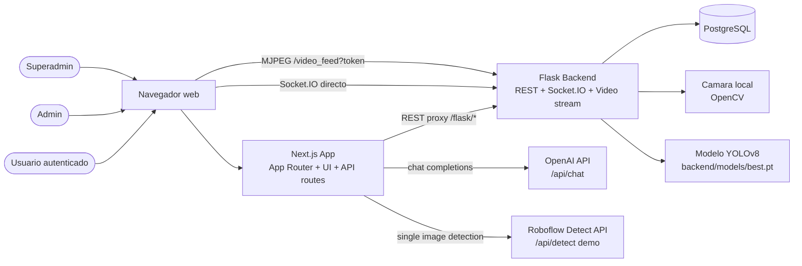

## 3. Casos de uso

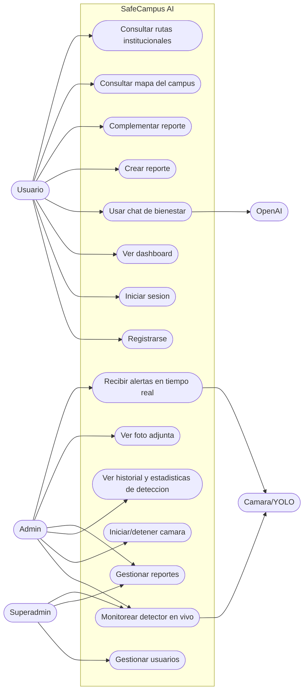

## 4. Componentes principales

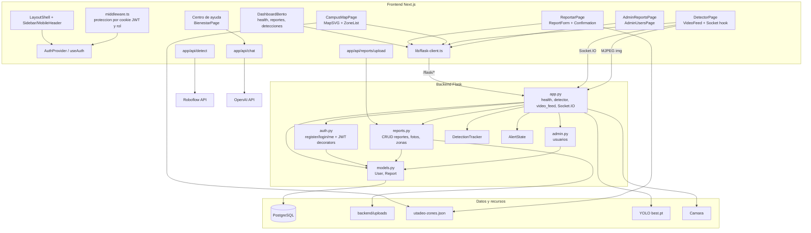

## 5. Modelo de dominio / clases

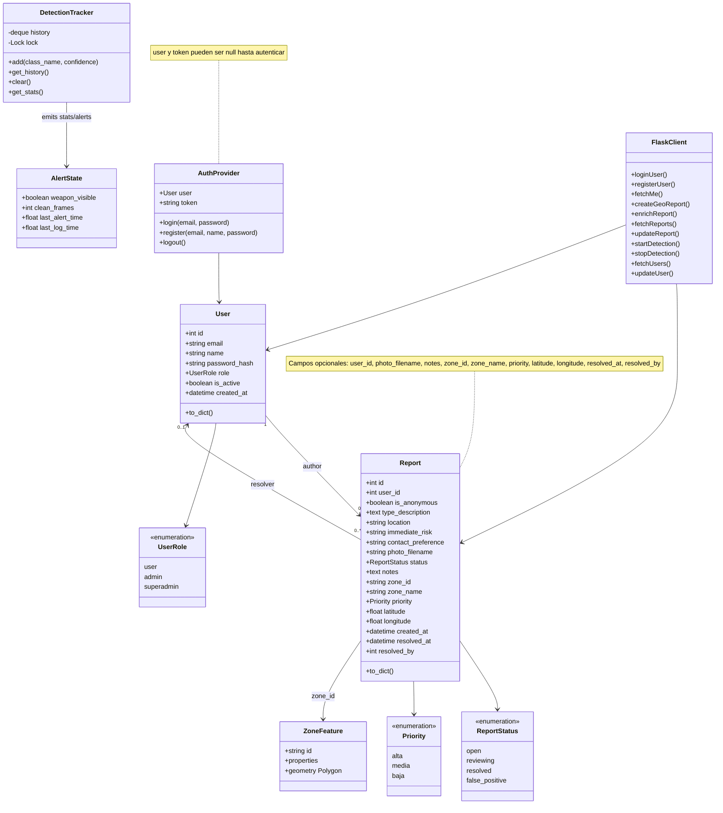

## 6. Entidad-relacion

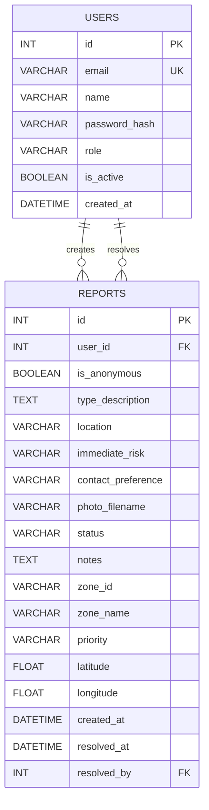

## 7. Navegacion y control de acceso

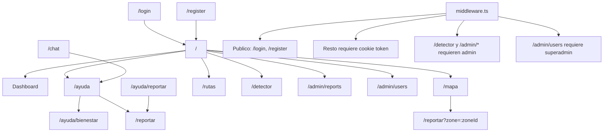

## 8. Secuencia: login y sesion

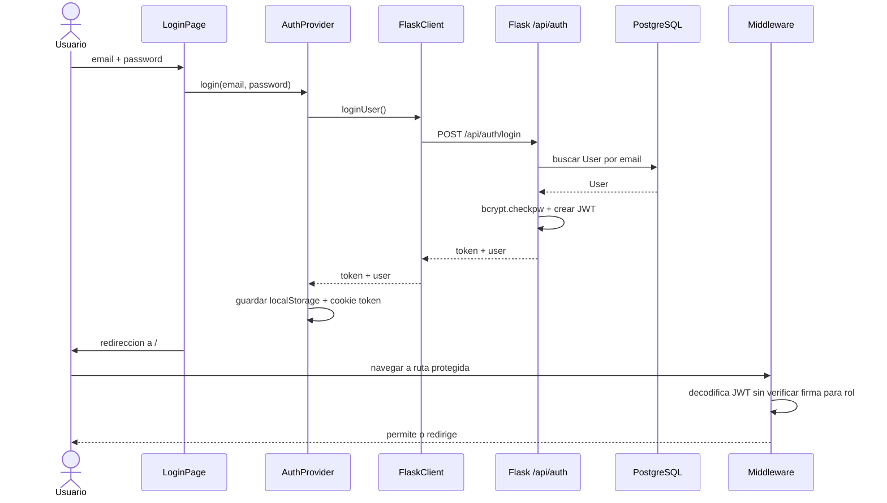

## 9. Secuencia: crear y complementar reporte

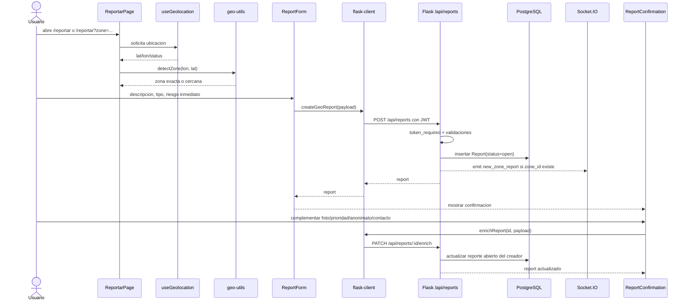

## 10. Secuencia: detector en vivo

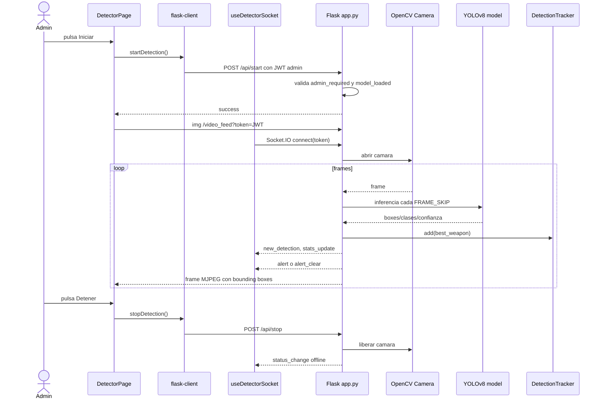

## 11. Secuencia: chat de bienestar

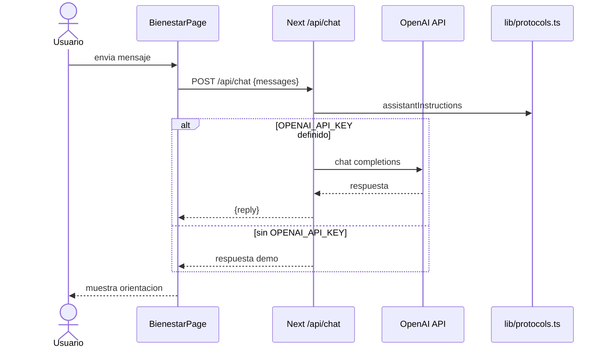

## 12. Secuencia: administracion de reportes y usuarios

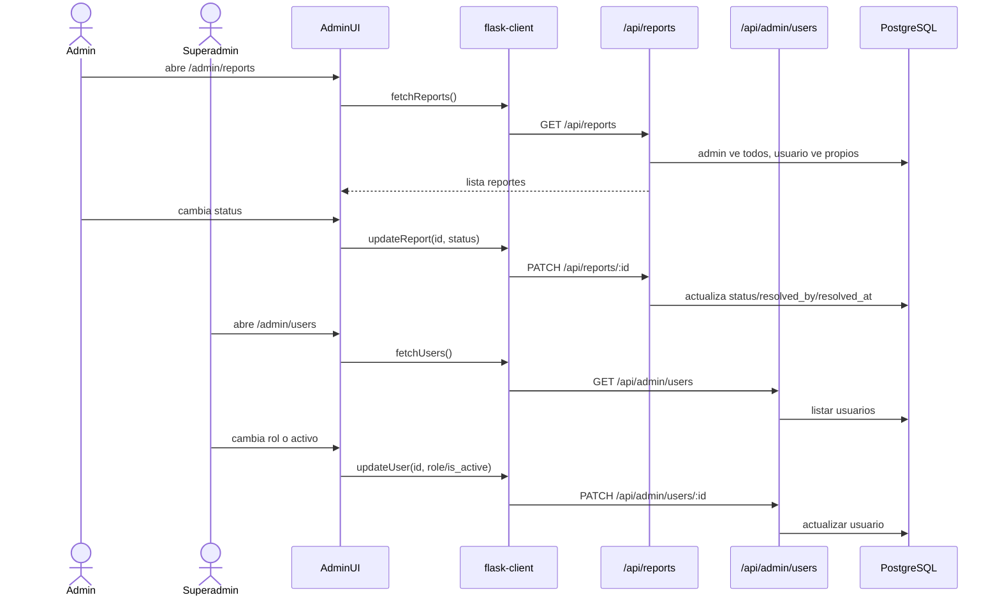

## 13. Estado: ciclo de vida de un reporte

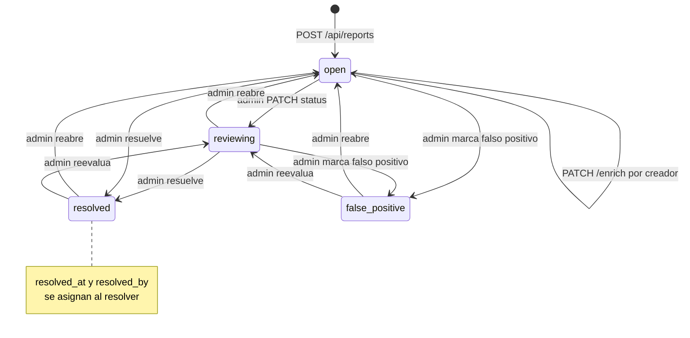

## 14. Estado: detector y alertas

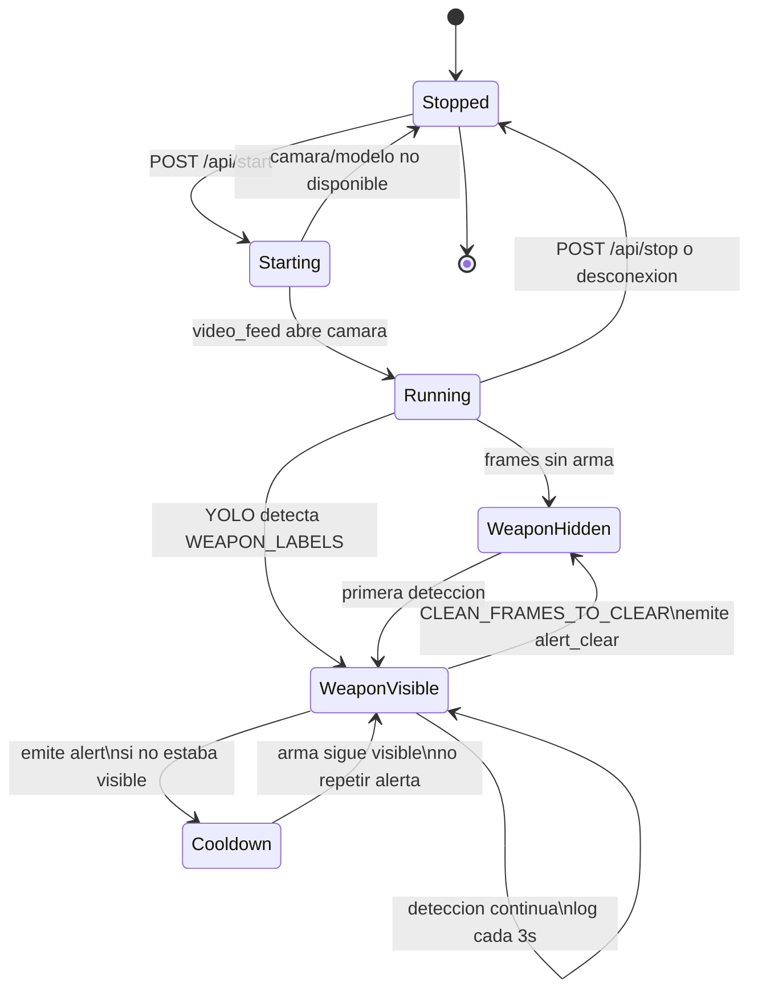

## 15. Despliegue local

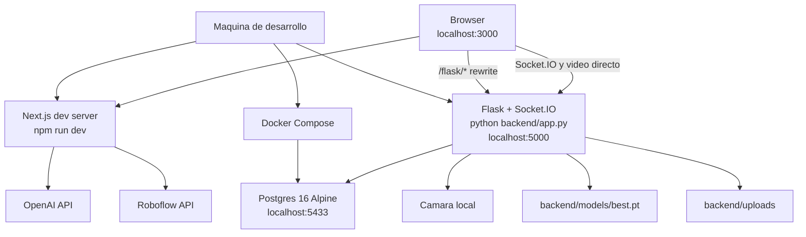

## 16. Contratos API principales

| Area | Endpoint | Metodo | Rol | Implementacion |
|---|---:|---:|---|---|
| Auth | `/api/auth/register` | POST | publico | `backend/auth.py` |
| Auth | `/api/auth/login` | POST | publico | `backend/auth.py` |
| Auth | `/api/auth/me` | GET | usuario | `backend/auth.py` |
| Reportes | `/api/reports` | POST | usuario | `backend/reports.py` |
| Reportes | `/api/reports` | GET | usuario/admin | propios o todos |
| Reportes | `/api/reports/by-zone` | GET | usuario | conteos activos por zona |
| Reportes | `/api/reports/:id` | GET | propietario/admin | detalle |
| Reportes | `/api/reports/:id/enrich` | PATCH | propietario | solo si `open` |
| Reportes | `/api/reports/:id` | PATCH | admin | estado/notas |
| Reportes | `/api/reports/:id/photo` | GET | propietario/admin | foto con token header/query |
| Admin | `/api/admin/users` | GET | superadmin | listar usuarios |
| Admin | `/api/admin/users/:id` | PATCH | superadmin | rol/activo |
| Admin | `/api/admin/users/:id` | DELETE | superadmin | desactivar |
| Detector | `/health` | GET | publico via proxy | salud DB/modelo/detector |
| Detector | `/video_feed?token=` | GET | admin | MJPEG directo |
| Detector | `/api/start` | POST | admin | activar detector |
| Detector | `/api/stop` | POST | admin | detener detector |
| Detector | `/api/history` | GET | admin | historial |
| Detector | `/api/clear-history` | POST | admin | limpiar historial |
| Detector | `/api/stats` | GET | usuario | estadisticas |
| Next API | `/api/chat` | POST | sesion web | OpenAI o demo |
| Next API | `/api/detect` | POST | no enlazado en UI actual | Roboflow o demo |
| Next API | `/api/reports/upload` | POST | sesion web | proxy JSON/base64 a Flask |

## 17. Eventos Socket.IO

| Evento | Direccion | Uso |
|---|---|---|
| `connect` | Browser -> Flask | conexion con `query.token` |
| `disconnect` | Browser -> Flask | cierre de cliente |
| `get_status` | Browser -> Flask | solicitar estado/stats |
| `status_change` | Flask -> Browser | `online` / `offline` |
| `stats_update` | Flask -> Browser | totales de deteccion |
| `new_detection` | Flask -> Browser | entrada de historial |
| `alert` | Flask -> Browser | arma detectada con confianza |
| `alert_clear` | Flask -> Browser | arma ya no visible |
| `new_zone_report` | Flask -> Browser | nuevo reporte con `zone_id` |

## 18. Notas de implementacion relevantes

- `middleware.ts` usa el JWT de cookie para decidir navegacion y rol, pero la verificacion criptografica real queda en Flask mediante decoradores `token_required`, `admin_required` y `superadmin_required`.
- Las llamadas REST del frontend usan `/flask/*`, reescrito por Next hacia `http://localhost:5000/*`.
- Socket.IO y `video_feed` van directo a `NEXT_PUBLIC_FLASK_URL` porque el stream MJPEG y WebSocket no dependen del proxy HTTP.
- El reporte nuevo nace en `open`; el usuario solo puede enriquecerlo mientras siga abierto.
- El detector en vivo depende de un modelo local `backend/models/best.pt`; si no existe, Flask no inicia el servicio de deteccion.
- `/api/detect` existe como endpoint Next.js para Roboflow/simulacion, pero no encontre consumidor actual en la UI clonado en este commit.
- `ChatPage`, `ReportPage`, `ZoneReportForm`, `ZoneReportHistory` y `ZoneDetection` existen como componentes auxiliares/legados; las rutas actuales montan principalmente `BienestarPage`, `ReportarPage` y `CampusMapPage`.

## 19. Arquitectura LLM con fine-tuning y RAG

Este diagrama plantea la evolucion del modulo de bienestar/chat para usar un LLM afinado con 500 pares pregunta-respuesta y una capa RAG para recuperar contexto institucional actualizado.

```mermaid
%%{init: {"theme": "base", "themeVariables": {"fontFamily": "Arial, Apple Color Emoji, Segoe UI Emoji, Noto Color Emoji, sans-serif"}}}%%
flowchart LR
  User(["<span style='font-size:28px'>👤</span><br/>Usuario SafeCampus"])
  ChatUI["<span style='font-size:28px'>💬</span><br/>BienestarPage / Chat UI"]
  ApiChat["<span style='font-size:28px'>⚙️</span><br/>Next.js /api/chat<br/>Orquestador LLM"]
  Safety["<span style='font-size:28px'>🛡️</span><br/>Guardrails de seguridad<br/>crisis, emergencias, alcance"]
  Prompt["<span style='font-size:28px'>🧩</span><br/>Construccion de prompt<br/>query + contexto + instrucciones"]
  FTModel["<span style='font-size:28px'>🧠</span><br/>LLM fine-tuned<br/>SafeCampus"]
  Response["<span style='font-size:28px'>✅</span><br/>Respuesta orientada<br/>bienestar, convivencia, rutas"]

  subgraph FineTuning["Pipeline de fine-tuning"]
    QASeed["<span style='font-size:28px'>📝</span><br/>Usuario + LLM<br/>crean 500 QA"]
    QACuration["<span style='font-size:28px'>🔎</span><br/>Curacion humana<br/>limpieza, etiquetas, tono"]
    TrainSplit["<span style='font-size:28px'>✂️</span><br/>Split train/validation"]
    FineTuneJob["<span style='font-size:28px'>🏋️</span><br/>Job de fine-tuning"]
    Eval["<span style='font-size:28px'>📊</span><br/>Evaluacion<br/>calidad, seguridad, alucinacion"]
    Registry["<span style='font-size:28px'>🏷️</span><br/>Registro/versionado<br/>modelo SafeCampus"]
  end

  subgraph RAG["Pipeline RAG"]
    Docs["<span style='font-size:28px'>📚</span><br/>Documentos privados e institucionales<br/>reglamentos, protocolos, rutas"]
    Normalize["<span style='font-size:28px'>🧹</span><br/>Normalizacion<br/>metadatos, permisos, fechas"]
    Split["<span style='font-size:28px'>🧱</span><br/>Chunking<br/>fragmentos recuperables"]
    EmbedDocs["<span style='font-size:28px'>🔢</span><br/>Modelo de embeddings"]
    VectorDB[("<span style='font-size:28px'>🗄️</span><br/>Vector store<br/>con embeddings")]
    Retrieval["<span style='font-size:28px'>🔍</span><br/>Busqueda semantica<br/>top-k + filtros"]
    Context["<span style='font-size:28px'>📌</span><br/>Contexto relevante<br/>con fuente y vigencia"]
  end

  subgraph Runtime["Inferencia en produccion"]
    QueryEmbed["<span style='font-size:28px'>📐</span><br/>Embedding de la consulta"]
    Session["<span style='font-size:28px'>🔐</span><br/>Sesion autenticada<br/>rol, idioma, canal"]
  end

  QASeed --> QACuration --> TrainSplit --> FineTuneJob --> Eval --> Registry --> FTModel
  Docs --> Normalize --> Split --> EmbedDocs --> VectorDB
  User --> ChatUI --> ApiChat
  ApiChat --> Session
  ApiChat --> Safety
  ApiChat --> QueryEmbed
  QueryEmbed --> Retrieval
  VectorDB --> Retrieval
  Retrieval --> Context
  Context --> Prompt
  Session --> Prompt
  Safety --> Prompt
  Prompt --> FTModel
  FTModel --> Response
  Response --> Safety
  Safety --> ApiChat
  ApiChat --> ChatUI
  ChatUI --> User

  classDef data fill:#e8f4ff,stroke:#1d4ed8,color:#0f172a
  classDef train fill:#fef3c7,stroke:#d97706,color:#0f172a
  classDef runtime fill:#ecfdf5,stroke:#059669,color:#0f172a
  classDef model fill:#f3e8ff,stroke:#7e22ce,color:#0f172a
  class QASeed,QACuration,TrainSplit,FineTuneJob,Eval,Registry train
  class Docs,Normalize,Split,EmbedDocs,VectorDB,Retrieval,Context data
  class QueryEmbed,Session,Prompt,Safety,ApiChat,ChatUI,Response runtime
  class FTModel model
```

Flujo esperado:

- El fine-tuning enseña tono, estructura de respuesta, criterios de escalamiento y patrones frecuentes de SafeCampus a partir de los 500 QA curados.
- RAG aporta conocimiento variable o extenso: reglamentos, protocolos, contactos, rutas institucionales, documentos privados y versiones vigentes.
- El orquestador combina consulta, contexto recuperado, instrucciones institucionales y guardrails antes de invocar el modelo fine-tuned.
- La respuesta final debe indicar limites del sistema y escalar a canales humanos cuando haya peligro inmediato, autolesion, violencia actual, arma visible o amenaza creible.
